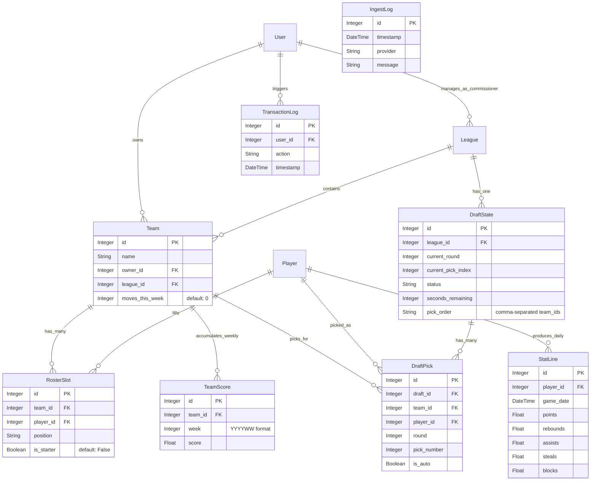

# Architecture

> **Scope:** MVP with features including user authentication, league/team management, player drafting, roster management, stats ingestion, and scoring.

---

## 1. High‑Level Components

| Layer               | Responsibility                                                       | Key Tech                                                        |
| ------------------- | -------------------------------------------------------------------- | --------------------------------------------------------------- |
| **Frontend**        | User registration, login, dashboard, draft room (placeholder), team management (placeholder), standings display. | React + Vite, TypeScript, TailwindCSS, WebSocket (for draft)    |
| **API Gateway**     | REST + WebSocket endpoints, authentication, OpenAPI docs.            | FastAPI, Uvicorn                                                |
| **Domain Services** | Draft engine, scoring engine, roster management, user services.      | Python service layer (plain classes: `DraftService`, `RosterService`, `ScoringService`) |
| **Persistence**     | Relational data (users, leagues, teams, players, draft, stats, scores), transaction log, ingest log. | SQLite (dev/default), SQLAlchemy (ORM), Alembic (migrations)    |
| **Scheduler**       | Nightly stats ingest, weekly score calculation, draft clock management, weekly roster move reset. | APScheduler (in‑process with FastAPI)                           |
| **External Data**   | WNBA box‑scores, player information, schedules.                      | RapidAPI - WNBA Stats (via `RapidApiClient`)                    |

---

## 2. Repo Layout

```
WNBA-Fantasy-League/
├── .github/              # GitHub-specific files (workflows, CoC)
├── alembic/              # Alembic migration scripts
│   ├── versions/         # Individual migration files
│   ├── env.py
│   └── README
├── app/                  # FastAPI backend application
│   ├── api/              # Routers (auth, draft, users, v1 endpoints)
│   │   ├── deps.py       # FastAPI dependencies (e.g., get_current_user)
│   │   └── schemas.py    # Pydantic schemas for API I/O
│   ├── core/             # Core components (config, database, security, scheduler, ws_manager)
│   ├── external_apis/    # Clients for external APIs (e.g., rapidapi_client.py)
│   ├── ingest/           # Data ingestion logic (currently integrated into jobs)
│   ├── jobs/             # APScheduler tasks (draft_clock, ingest, reset_weekly_moves, score_engine)
│   ├── models/           # SQLAlchemy ORM models
│   ├── services/         # Business logic services (draft, roster, scoring)
│   ├── __init__.py
│   └── main.py           # FastAPI application entrypoint & scheduler setup
├── docs/                 # Project documentation (Story files, API notes, etc.)
├── frontend/             # React (Vite) frontend application
│   ├── src/
│   │   ├── components/   # Reusable UI components (e.g., ProtectedRoute.tsx)
│   │   ├── contexts/     # React contexts (e.g., AuthContext.tsx)
│   │   ├── lib/          # Utility libraries (e.g., api client wrapper - implied)
│   │   ├── pages/        # Top-level route components (Dashboard, Login, Draft, Team)
│   │   └── types/        # TypeScript type definitions
│   ├── vite.config.ts
│   └── tailwind.config.js
├── scripts/              # Utility scripts (fetch_demo, manage, seed_demo)
├── tests/                # Pytest test suite
├── .pre-commit-config.yaml
├── alembic.ini
├── conftest.py           # Pytest configuration
├── Makefile
├── pyproject.toml        # Poetry configuration
└── README.md
```

---

## 3. Data Model (Simplified)



*See `app/models/__init__.py` for exact fields and relationships.*
*Key additions: `DraftState`, `DraftPick` for draft functionality. `RosterSlot.is_starter` and `Team.moves_this_week` for roster management.*

---

## 4. Runtime Flow (Key Scenarios)

1.  **User Authentication:**
    *   Frontend `LoginPage` submits credentials to `POST /api/v1/token`.
    *   Backend validates, returns JWT. Token stored in `localStorage`.
    *   `AuthContext` manages auth state; `ProtectedRoute` guards routes.
    *   Authenticated requests include `Authorization: Bearer <token>` header.

2.  **Draft Phase:**
    *   Commissioner starts draft: `POST /api/v1/leagues/{league_id}/start`.
    *   `DraftService` creates `DraftState`, generates snake pick order.
    *   Frontend connects to `/api/v1/draft/ws/{league_id}`.
    *   `ConnectionManager` handles WebSocket connections.
    *   Users make picks: `POST /api/v1/draft/{draft_id}/pick`.
        *   `DraftService` validates pick (turn, player availability, roster rules).
        *   Creates `DraftPick`, adds player to `RosterSlot`.
        *   Advances `DraftState`.
    *   `DraftService` broadcasts `pick_made` event via WebSocket; `manager.broadcast_to_league`.
    *   `check_draft_clocks` job (APScheduler) decrements timer, triggers `DraftService.auto_pick` if timer expires.
    *   Commissioner can `POST /api/v1/draft/{draft_id}/pause` or `/resume`.

3.  **Nightly Stats Ingestion & Scoring (Scheduled):**
    *   `ingest_stat_lines` job (APScheduler):
        *   Fetches game schedule for previous day via `RapidApiClient`.
        *   For each game, fetches box-score.
        *   Upserts `Player` and `StatLine` data.
        *   Logs errors to `IngestLog`.
    *   `run_engine` job (APScheduler, calls `update_weekly_team_scores`):
        *   Aggregates `StatLine` points for each player on a roster.
        *   Calculates total fantasy points for each team for the week.
        *   Upserts `TeamScore` records.

4.  **Roster Management:**
    *   User lists free agents: `GET /api/v1/leagues/{league_id}/free-agents`.
    *   User adds player: `POST /api/v1/teams/{team_id}/roster/add`.
        *   `RosterService` validates move limit (`Team.moves_this_week`), roster size, player availability.
        *   Creates `RosterSlot`. If `set_as_starter` is true, `Team.moves_this_week` is incremented.
        *   Logs to `TransactionLog`.
    *   User drops player: `POST /api/v1/teams/{team_id}/roster/drop`.
        *   `RosterService` validates. Deletes `RosterSlot`. Logs to `TransactionLog`.
    *   User sets starters: `PUT /api/v1/teams/{team_id}/roster/starters`.
        *   `RosterService` validates lineup size, positional legality (≥2 G, ≥1 F/F-C), move limit for new starters.
        *   Updates `RosterSlot.is_starter`. Increments `Team.moves_this_week` for each player moved to starter. Logs to `TransactionLog`.
    *   `reset_weekly_moves` job (APScheduler) resets `Team.moves_this_week` to 0 every Monday.

5.  **Frontend Data Display:**
    *   `DashboardPage` fetches `/api/v1/leagues` and `/api/v1/scores/current`.
    *   Other pages (Draft, Team) are placeholders for now.

---

## 5. Auth Strategy

*   **Primary:** JWT Bearer Tokens.
    *   Generated via `POST /api/v1/token` (OAuth2PasswordRequestForm).
    *   Validated by `app.api.deps.get_current_user` dependency.
    *   `SECRET_KEY` and `ACCESS_TOKEN_EXPIRE_SECONDS` configured in `app.core.config.py`.
*   Passwords hashed with **bcrypt** via `passlib` (`app.core.security.py`).
*   No separate cookie-based auth implemented yet, despite earlier story; focus is on JWT.

---

## 6. Observability & Logs

*   **Access Log:** Standard Uvicorn access logs.
*   **Application/Change Log:** Custom `TransactionLog` table populated by domain services for significant actions (draft picks, roster moves). Viewable via admin endpoint.
*   **Ingest Log:** `IngestLog` table records errors and notable events from the data ingestion process. Viewable via admin endpoint.
*   **Metrics:** (Future) Optional Prometheus exporter.

---

## 7. Deployment Pipeline (GitHub Actions)

1.  Push/PR to `main` triggers `/.github/workflows/ci.yml`.
2.  Sets up Python 3.12.
3.  Caches Poetry dependencies.
4.  Installs dependencies (`poetry install`).
5.  Runs `make lint` (Ruff, isort, Black checks).
6.  Runs `make test` (Pytest).
7.  (Future) Build multi-arch Docker image.
8.  (Manual/Fly.io specific) Post-deploy step: `alembic upgrade head`.

---

## 8. Local Dev Tips

*   Use `make format` (runs Ruff fix, isort, Black) before committing.
*   VS Code users: Recommended extensions in `.vscode/extensions.json` (if present, or use Pylance/Ruff extensions).
*   To reset DB and apply migrations: `rm dev.db && poetry run alembic upgrade head`.
*   Use `scripts/seed_demo.py --force` to repopulate with basic demo data.
*   API docs available at `http://localhost:8000/docs` when dev server is running.

---

## 9. Future Extensions & Considerations

| Area                 | Notes                                                                                                |
| -------------------- | ---------------------------------------------------------------------------------------------------- |
| **Database**         | Migrate from SQLite to PostgreSQL for production for better concurrency and features.                |
| **Frontend UI**      | Implement full Draft Room UI (Story-14), Roster Management UI (part of Story-10), Scoreboard (Story-13). |
| **Bonuses**          | Implement Weekly Bonus Calculator (Story-11).                                                        |
| **Dockerization**    | Fully Dockerize backend and frontend for consistent environments and easier deployment (Story-15).   |
| **External APIs**    | Expand player/game information endpoints using RapidAPI (Stories 19-22).                             |
| **Production Setup** | Develop robust scripts for priming a production database with users, leagues, and historical data (Story-23). |
| **Push Notifications** | Add push notifications for draft events, game starts, etc.                                          |
| **Scalability**      | Consider Celery or other task queues if APScheduler becomes a bottleneck. Use Redis for caching.      |
| **Advanced Auth**    | OAuth (Google/Social) login.                                                                         |
```