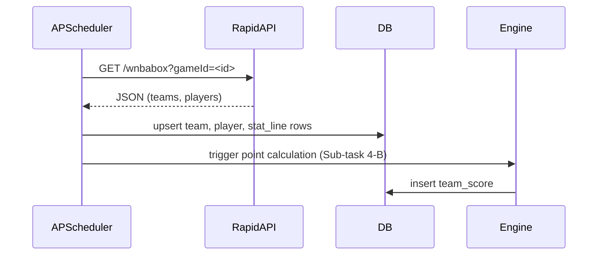

# FANTASY‑4 — Points Calculation & Engine

> **Story ID:** FANTASY‑4  |  *Compute Fantasy Points Nightly*
>
> This story covers the rules engine that converts raw box‑score statistics into weekly and season‑long fantasy points **and** the nightly batch job that persists those numbers.

**Status:** Complete

| Sub‑task                       | What / Why                                | Acceptance Criteria                                                                                                                      |
| ------------------------------ | ----------------------------------------- | ---------------------------------------------------------------------------------------------------------------------------------------- |
| **4‑A Point Formula Function** | Pure Python fn returns fantasy pts        | Unit tests for normal/edge cases (triple‑double). |
| **4‑B Engine Service**         | Batch compute totals for each `stat_line` | Writes to `team_score` table.                                                                                                            |
| **4‑C Cron Trigger**           | Schedule nightly recompute                | Finishes < 2 min for season so far (≈ 5k rows).                                                                                          |
| **4‑D Backfill Command**       | CLI `python manage.py backfill 2024`      | Replays entire season if needed.                                                                                                         |

---

## 🏀 RapidAPI Data Source

The project ingests live WNBA data from **[wnba‑api.p.rapidapi.com](https://rapidapi.com/)**.  This section documents the slices we use so future maintainers (or other o3 instances) can extend or debug without reverse‑engineering the client code.

### 1. Authentication & Rate Limits

| Header            | Value                                           |
| ----------------- | ----------------------------------------------- |
| `x‑rapidapi‑key`  | *(env var `WNBA_API_KEY`, **never** committed)* |
| `x‑rapidapi‑host` | `wnba-api.p.rapidapi.com`                       |

* Current tier: 14,000 requests / month, 300 req / minute (as of 2025‑05‑06).  Configure the APScheduler job to stay well below this budget.\*

### 2. Endpoints in Use

| Endpoint                | Purpose                                          | Key Params         | Sample Call                              |
| ----------------------- | ------------------------------------------------ | ------------------ | ---------------------------------------- |
| **`/wnbabox`**          | Single‑game box score → player + team stat lines | `gameId` (ESPN ID) | `GET /wnbabox?gameId=401244185`          |
| **`/wnbateamlist`**     | All active franchises                            | `limit` (opt)      | `GET /wnbateamlist?limit=12`             |
| **`/players/id`**       | Roster lookup by team                            | `teamId`           | `GET /players/id?teamId=14`              |
| **`/player-statistic`** | Career & season aggregates                       | `playerId`         | `GET /player-statistic?playerId=2987869` |

### 3. Field Mapping → `stat_line`

The JSON structures are verbose.  We normalise only the columns needed for scoring:

| RapidAPI Key                                                  | Our Column (`stat_line`) | Notes                                   |
| ------------------------------------------------------------- | ------------------------ | --------------------------------------- |
| `points`                                                      | `pts`                    | INT                                     |
| `rebounds` → sum of `offensiveRebounds` + `defensiveRebounds` | `reb`                    |                                         |
| `assists`                                                     | `ast`                    |                                         |
| `steals`                                                      | `stl`                    |                                         |
| `blocks`                                                      | `blk`                    |                                         |
| `turnovers`                                                   | `to`                     |                                         |
| `threePointFieldGoalsMade`                                    | `fg3m`                   | Needed for bonus                        |
| `minutes`                                                     | `min`                    | Float minutes (for future pace metrics) |

> ⚠️ `threePointFieldGoalPct` etc. are **not** stored; derive on demand.

Mapping lives in `app/ingest/adapters/rapid_api.py` so swapping data providers only touches that module.

### 4. Example Workflow

### 5. Testing Fixtures

* `tests/fixtures/box_401244185.json` — frozen response for deterministic unit tests
* `tests/fixtures/player_2987869.json` — player split stats

Load fixtures with `pytest.mark.datafiles` to avoid hitting the live API during CI.

---

## FAQ / Troubleshooting

* **`HTTP 429`** — you blew past the minute‑level cap.  Increase `jobstores.default.max_instances` or add a jitter.
* **Missing players in `/wnbabox`** — occasionally inactive or exempt athletes appear with `stats: []`.  The adapter must tolerate empty arrays.
* **Historic seasons** — endpoint coverage reliably extends back to 2018.  Earlier seasons return `404`.

---
