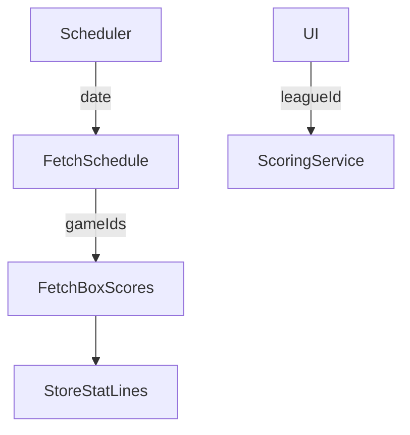

# RapidAPI WNBA Stats – Integration Recommendation

## Summary

After evaluating free/low-cost WNBA data sources, **RapidAPI – WNBA Stats** stands out as the only service that:

* Provides complete player & team box-scores back to 2018.
* Mirrors ESPN's data model (reliable, timely).
* Fits under RapidAPI global free limits (≤ 1 000 requests/hour, 500 k / month) — our league requires < 15 k / season.
* Requires only a single header `X-RapidAPI-Key`, making local dev simple (key stored in `.env`).

Hence we recommend standardising on this endpoint for nightly ingest + on-demand fetches.

## Endpoint Coverage Needed

| Domain Use-Case | Endpoint | Frequency |
|-----------------|----------|-----------|
| List active teams & meta | `/wnbateams/list` | Startup cache (once) |
| Nightly ingest stats | `/wnbaboxscore/{gameId}` | ≈6 calls/night during season |
| Future schedule for ingest planning | `/wnbaschedule/{YYYYMMDD}` | Daily |
| On-demand: player bio | `/wnbaplayer/{playerId}` | Draft UI (~rare) |

Total: &lt; 200 requests/week.

## Proposed Client Abstraction

* `services/rapidapi_client.py` — thin wrapper (env key, retry, timeouts).
* `jobs/ingest.py` — APScheduler task orchestrating schedule → box-score ingest.
* `models/stat_line.py` — already defined; mapping table in `docs/api_comparison.md` shows field transforms.

## Error Handling & Rate Limits

* Use `httpx.AsyncClient` with `backoff` on 429/500.
* Persist last-run cursor to skip already-ingested games.
* Include `X-RapidAPI-Requests-Remaining` header in logs.

## Future Work

* Evaluate Sportradar official feed (paid) as upgrade path.
* Add cache layer (Redis) if UI needs live scoreboard per 30 s.